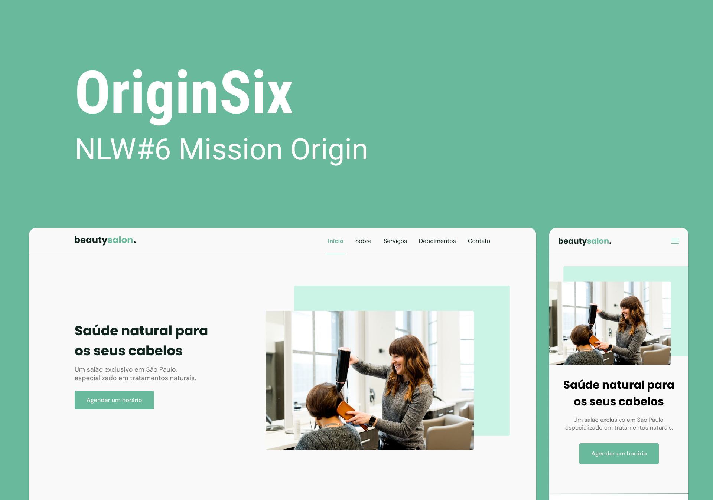

  

<h2 id="tec"> 🚀 Tecnologias</h2>

Esse projeto foi desenvolvido com as seguintes tecnologias:

- HTML
- CSS
- JavaScript

Bibliotecas

- [Google Fonts](https://fonts.google.com/)
- [SwipeJS](https://github.com/nolimits4web/Swiper)
- [ScrollRevel](https://scrollrevealjs.org)

Utilitários

- [randomuser.me](https://randomuser.me/photos)
- [IconMoon](https://icomoon.io/app/#/select)

<h2 id="projeto"> 💻 Projeto </h2>

OriginSix é uma página institucional no formato One Page, responsiva, para usar em diversos tipos de micro, pequena e média empresas. Contém as seguintes seções: Header, Navigation, Home, Sobre, Serviços, Depoimentos, Contato e Footer

<h2 id="layout"> 🔖 Layout </h2>

Você pode visualizar o layout do projeto através [desse link](https://www.figma.com/community/file/1009807319507822993/Origin-Six). É necessário ter conta no [Figma](https://figma.com) para acessá-lo.

 <h2 id="autor"> 📌 Autor </h2>
  

    
    
Feito com ❤️ & ☕ por Myguel Angello,  👋🏽 entre em contato

    
Estudante de Sistemas e Mídias Digitais | UFC

    
    
      
  

 
